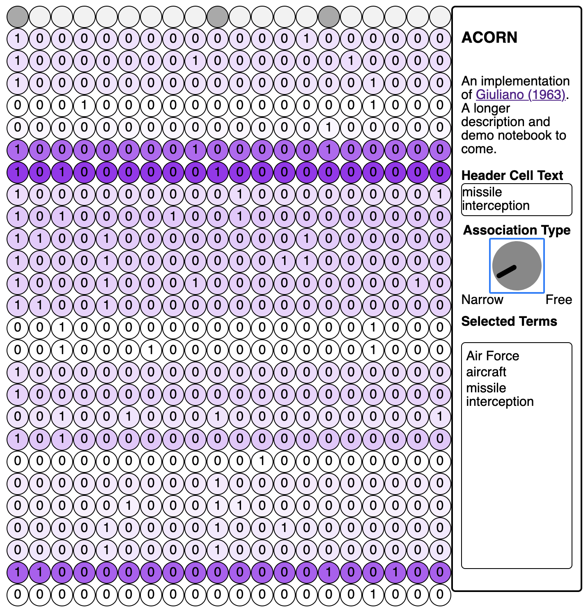

ACORN
=====

Description and demos to come. For now, here's a screenshot:



### Installing the web app

The web app version of ACORN uses a Flask API to send query information and
receive document associations. All Python libraries are managed with conda; the
conda environment file is `env.yml`.

The app also requires you to have a web server running. Flask will serve from
port 5000.

Steps

1. Move this repository to wherever your computer serves websites
2. From the root of the repository, create a new directory called `assets/`
   ```{bash}
   mkdir assets
   ```
3. Download the [JS dependencies](#dependencies) and the [font file as well as
   some sample data][data]. Place all of this in `assets/`
4. Install the conda environment
   ```{bash}
   conda env create --name envname --file=env.yml
   ```
5. Activate the environment
   ```{bash}
   conda activate acorn
   ```
6. Start the app
   ```{bash}
   python3 src/main.py
   ```
7. In a web browser, navigate to http://localhost/ACORN. The app should be
   displayed there

[data]: http://tylershoemaker.info/data/ACORN

### Dependencies

The app requires two external JS libraries, which should be placed in `assets/`
(see step 2 above). It uses minified versions of both libraries.

1. [Papa Parse](https://www.papaparse.com)
2. [input-knob.js](https://g200kg.github.io/input-knobs/)
