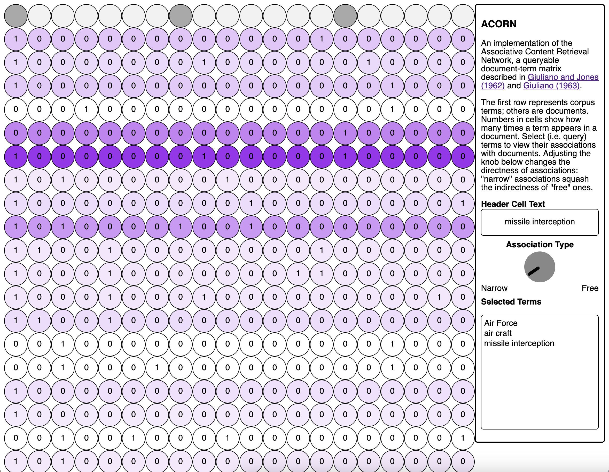

ACORN
=====

This is a Python implementation of the Associative Content Retrieval Network,
or ACORN. The original system, developed by Paul Jones and Vincent Giuliano at
Arthur D. Little Inc. in the 1960s, was a large electrical circuit. Jones and
Giuliano used it to model statistical associations in corpora; its posts
represented terms and documents and the conductance on the wires connecting
those posts represented term counts. Those familiar with NLP methods will
recognize ACORN as a document--term matrix (DTM)---but an analog one, which
circumvented the shortcomings of mainframe DTMs (namely limited memory capacity
and computation time).

My implementation is based on two publications:

1. Paul E. Jones and Vincent E. Giuliano, ["Linear Associative Information
   Retrieval"][https://apps.dtic.mil/sti/tr/pdf/AD0290313.pdf)
2. Vincent E. Giuliano, ["Analog Networks for Word
   Association"](https://ieeexplore.ieee.org/document/4323077/)

See Appendix I in the latter for equations that describe ACORN. Most of the
code in this repository follows those.

How It Worked
-------------

Working on the basis of contracts with the US Air Force, Jones and Giuliano
developed four different versions of ACORN. The first one is below.


The code in this repository implements ACORN's circuitry and the linear
transformations Jones and Giuliano devised to model term and document
associations. ACORN worked on the basis of queries. Users would select a term
or set of terms and send their selection to the network, which would return
associations; light bulbs on the system would brighten or dim depending on
association strength (these bulbs are the ancestors to the common strategy of
visualizing attention heads in modern Transformers networks with shading).
There are three association types available with ACORN:

1. Term--document associations
2. Term--term associations
3. Document--document associations

Usage
-----

The Python version of ACORN exposes these association types with a series of
methods attached to a `ConnectionBlock` class. Initialize it like so:

```python
import numpy as np
from acorn import ConnectionBlock

dtm = np.array([[1, 1, 0], [0, 1, 1], [1, 1, 1]])
block = ConnectionBlock(dtm)
print(block)
>>> A (6 x 6) connection block.
```

Return document associations for a query:

```python
q = np.array([1, 0, 0])
block.query(q)
>>> array([0.3808383 , 0.22932315, 0.33950618])
```

Return document associations that ignore additional context supplied by
term--term and document--document associations

```python
block.query_DTM(q)
>>> array([0.12770842, 0.00192225, 0.09331173])
```

Return term--term associations with no query specified

```python
block.word_associations()
>>> array([[1.1796384 , 0.20690882, 0.11903221],
           [0.19705604, 1.2913104 , 0.19705604],
           [0.1190322 , 0.20690885, 1.1796383 ]], dtype=float32)
```

Return document--document associations with no query specified:

```python
block.document_associations()
>>> array([[1.5714285 , 0.42857143, 0.6875    ],
           [0.42857143, 1.5714285 , 0.6875    ],
           [0.5       , 0.5       , 1.71875   ]], dtype=float32)
```

An key functionality for ACORN is its ability to set a normalization value when
building a corpus or when making a query. Normalization boosts/dampens the
effects of distant associations. A smaller value sets a higher cutoff for final
association rankings, while a larger one lowers that cutoff and will return a
wider set of associations. Under the hood, the code relies on a separate
`ResistorBlock` to perform normalization. For the original system, Jones and
Giuliano added normalization with a set of resistors.

Set a normalization value when initializing ACORN:

```python
block = ConnectionBlock(dtm, norm_by = 0.4)
```

Set a normalization value for a query:

```python
block.query(q, norm_by = 0.33)
>>> array([0.49405882, 0.32601407, 0.43807861])
```

Installing ACORN into a Python environment will enable to you use it for corpus
analysis work. The metrics it provides are somewhat similar to tf-idf values.
But I've also built a small app, which allows for direct querying. This is much
closer to the way Jones and Giuliano used the original system. Instructions for
installing both the Python code and the app are below.



Installation
------------

There are two separate parts to installation. The first part installs code that
implements ACORN itself, while the second sets up an app for working
interactively with the network.

### ACORN

Besides the ACORN source files in `src/`, all dependencies are managed with
conda; the conda environment file is `env.yml`. Once you have cloned this
repository, go through the following steps.

Steps

1. Install the conda environment
   ```sh
   conda env create --name=acorn --file=env.yml
   ```
2. Activate the environment
   ```sh
   conda activate acorn
   ```
3. Install ACORN via pip (ensure you do so from the top of the repository)
   ```sh
   pip install .
   ```

### Web App

The web app uses a Flask API to send query information and receive document
associations. It requires you to have a web server running. Flask will serve
from port 5000.

Steps

1. Move this repository to wherever your computer serves websites.
   Alternatively, [use Python][pyweb] (and a terminal multiplexer) to run a
   server directly from here
2. From the root of the repository, create a new directory called `assets/` and
   a subdirectory therein, `data/`
   ```sh
   mkdir -p assets/data
   ```
3. Download the [JS dependencies](#app-dependencies) and the [font file as well
   as some sample data][data]. Place everything but the data into `assets/`.
   Put the data in `assets/data`
4. Activate the environment and start the app
   ```sh
   conda activate acorn
   python3 src/main.py
   ```
5. In a web browser, navigate to http://localhost/ACORN. The app should be
   displayed there

[pyweb]: https://realpython.com/python-http-server
[data]: http://tylershoemaker.info/data/ACORN

### App Dependencies

The app requires two external JS libraries, which should be placed in `assets/`
(see step 2 above). If needed, see the header section in `index.html` for
file names

1. [Papa Parse (minified)](https://www.papaparse.com)
2. [input-knob.js](https://g200kg.github.io/input-knobs/)
